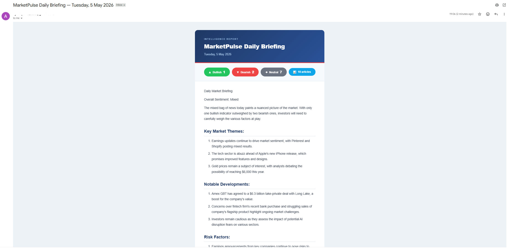
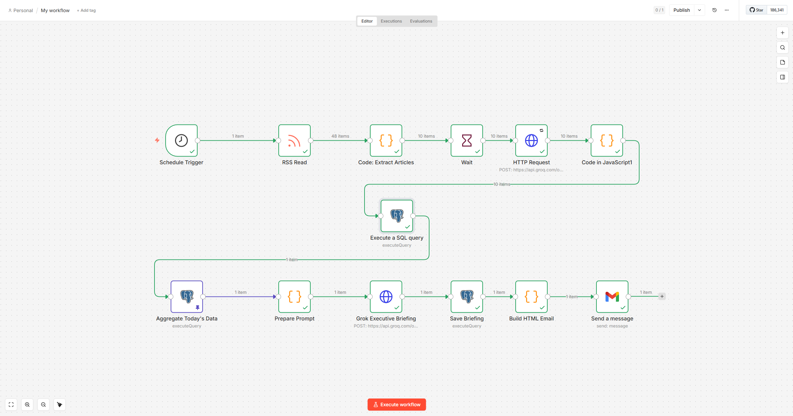

# MarketPulse Intelligence Agent

A self-hosted financial market intelligence pipeline built on N8N, PostgreSQL, and Groq AI (Llama 3.1). Automatically fetches financial news from Yahoo Finance RSS, analyses each article using an LLM for structured sentiment extraction, persists results in PostgreSQL, and delivers a professional daily briefing to your inbox, fully automated, zero cloud cost.

---

## Demo



> Daily briefing email showing sentiment statistics, LLM-generated market analysis, and structured sections.

---

## Architecture



> Full 13-node N8N workflow from RSS ingestion through two-stage Groq LLM analysis to PostgreSQL persistence and Gmail delivery.

```
Schedule Trigger (weekdays 7:30 AM)
        │
        ▼
  RSS Read (Yahoo Finance)
        │  42+ articles
        ▼
Code: Extract Articles
        │  top 10 articles
        ▼
   Wait (3s delay)          ← rate limit protection
        │
        ▼
HTTP Request → Groq API     ← per-article LLM analysis
  (Llama 3.1-8b-instant)
        │
        ▼
Code: Parse LLM Response    ← structured JSON extraction
        │
        ▼
PostgreSQL INSERT            ← persist sentiment data
        │
        ▼
PostgreSQL Aggregate Query   ← count bullish/bearish/neutral
        │
        ▼
Prepare Prompt (Code node)  ← sanitise data for LLM
        │
        ▼
HTTP Request → Groq API     ← executive briefing synthesis
        │
        ▼
Save Briefing → PostgreSQL  ← store daily briefing
        │
        ▼
Build HTML Email (Code)     ← format styled email
        │
        ▼
Gmail (OAuth2)              ← send daily briefing
```

---

## Features

- **Automated scheduling** : runs every weekday morning via N8N cron trigger
- **Multi-article ingestion** : fetches and processes up to 10 articles per run from Yahoo Finance RSS
- **Two-stage LLM pipeline** : per-article structured extraction followed by aggregate synthesis
- **Structured sentiment analysis** : extracts sentiment label, confidence score, summary, and risk keywords per article
- **PostgreSQL persistence** : stores all article analysis and daily briefings with indexed queries for historical tracking
- **Professional HTML email** : styled briefing with sentiment statistics, key themes, notable developments, risk factors, and outlook
- **Fully self-hosted** : runs on your own machine via Docker Compose, no cloud subscriptions needed
- **Zero ongoing cost** : Groq free tier, Yahoo Finance RSS (no key), Gmail OAuth2

---

## Tech Stack

| Layer | Technology |
|---|---|
| Workflow orchestration | N8N (self-hosted) |
| Database | PostgreSQL 15 |
| LLM | Groq API — Llama 3.1 8B Instant (free tier) |
| News source | Yahoo Finance RSS |
| Email delivery | Gmail via OAuth2 |
| Infrastructure | Docker Compose |
| Scripting | JavaScript (N8N Code nodes) |

---

## Quick Start

### Prerequisites

- Docker Desktop installed and running
- A free Groq API key from [console.groq.com](https://console.groq.com) (no credit card required)
- A Gmail account with OAuth2 credentials from Google Cloud Console

### 1. Clone the repository

```bash
git clone https://github.com/YOUR_USERNAME/n8n-marketpulse.git
cd n8n-marketpulse
```

### 2. Start the stack

```bash
docker compose up -d
```

This starts two containers:
- **N8N** on `http://localhost:5678`
- **PostgreSQL** on port `5432` with the schema auto-initialised from `init.sql`

### 3. Open N8N

Go to `http://localhost:5678` and log in:
- Username: `admin`
- Password: `admin123`

> Change the password in `docker-compose.yml` before sharing or deploying.

### 4. Import the workflow

1. In N8N, go to **Workflows** → **Add workflow** → **Import from file**
2. Upload the file from `workflows/marketpulse_workflow.json`
3. Set up your credentials (see below)

### 5. Configure credentials

You need three credentials in N8N (Settings → Credentials):

**Groq API (Header Auth)**
- Name: `Authorization`
- Value: `Bearer YOUR_GROQ_API_KEY`

**PostgreSQL**
- Host: `postgres`
- Port: `5432`
- Database: `n8ndb`
- Username: `n8nuser`
- Password: `n8npass123`

**Gmail (OAuth2)**
- Create OAuth2 credentials in [Google Cloud Console](https://console.cloud.google.com)
- Authorised redirect URI: `http://localhost:5678/rest/oauth2-credential/callback`
- Scopes: `gmail.send` and `userinfo.email` only

### 6. Activate the workflow

Toggle the workflow to **Active** in N8N. It will run automatically at 7:30 AM on weekdays, or you can trigger it manually anytime.

---

## Database Schema

```sql
-- Stores per-article LLM analysis
market_articles (
  id, ticker, title, url, published_at, source,
  grok_sentiment, grok_confidence, grok_summary,
  grok_key_events, grok_risk_keywords, grok_implication,
  processed_at
)

-- Stores daily synthesised briefings
daily_briefings (
  id, briefing_date, overall_sentiment,
  executive_summary, articles_analyzed,
  email_sent, created_at
)
```

Query historical sentiment data directly:

```sql
-- Sentiment trend over the last 7 days
SELECT
  DATE(processed_at) as date,
  COUNT(CASE WHEN grok_sentiment = 'bullish' THEN 1 END) as bullish,
  COUNT(CASE WHEN grok_sentiment = 'bearish' THEN 1 END) as bearish
FROM market_articles
WHERE processed_at >= NOW() - INTERVAL '7 days'
GROUP BY DATE(processed_at)
ORDER BY date;
```

---

## Project Structure

```
n8n-marketpulse/
├── docker-compose.yml          # N8N + PostgreSQL stack
├── init.sql                    # Database schema (auto-runs on first start)
├── workflows/
│   ├── marketpulse_workflow.json   # N8N workflow export (import this)
│   └── WORKFLOW_SETUP.md           # Step-by-step workflow configuration
├── screenshots/
│   └── email-preview.png           # Sample briefing email
└── README.md
```

---

## Security Design

- **Least privilege OAuth2** — Gmail credential scoped to `gmail.send` only, no read or delete access
- **API rate limiting** — 3-second wait between Groq API calls to stay within free tier limits
- **Credential vault** — all API keys stored in N8N's built-in encrypted credential store, never in workflow JSON
- **No secrets in code** — `docker-compose.yml` uses environment variables; replace defaults before any non-local deployment

---

## How to Export Your Workflow

To update `workflows/marketpulse_workflow.json` with your current workflow:

1. Open your workflow in N8N
2. Click the **⋮** menu (top right)
3. Click **Download**
4. Replace `workflows/marketpulse_workflow.json` with the downloaded file

> Note: N8N strips credential values from exports automatically safe to commit.

---

## License

MIT — free to use, modify, and build on.
